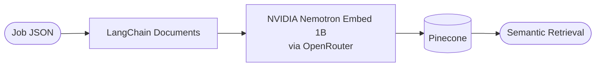
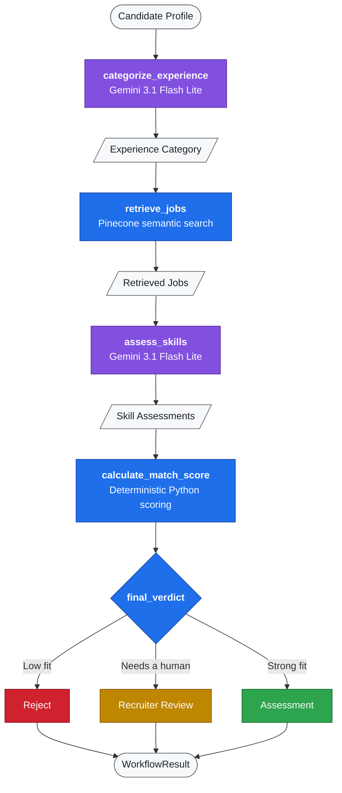
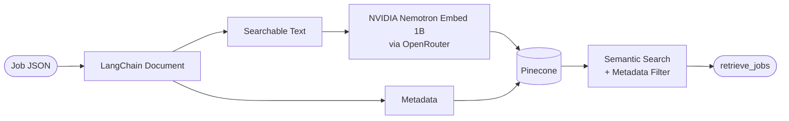
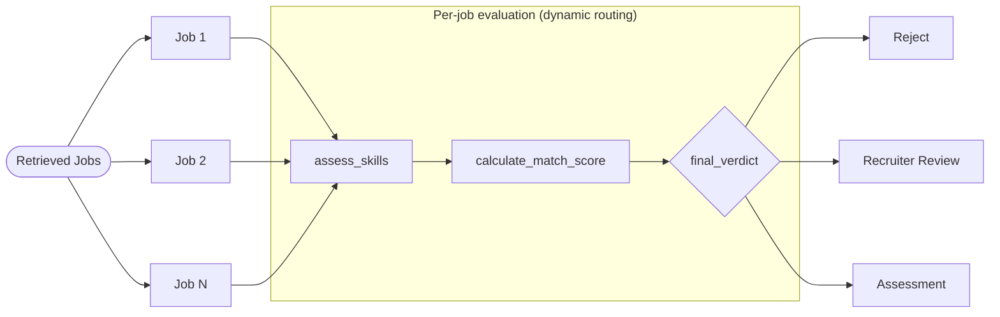

<h1 align="center">🤖 Talent Acquisition Agent</h1>

<p align="center">
  AI-assisted recruitment workflow built with <b>Python, LangChain, LangGraph, Gemini, OpenRouter, and Pinecone</b>.
</p>

<p align="center">
  
  
  
  
  
</p>

---

## 🎯 What it does

<em>I feel that <b>finding your first role in tech shouldn't feel like sending resumes into a black box</b>.</em> My latest project is a multi-agent Talent Acquisition workflow that supports and smoothens the process of hiring for both the candidate and the recruiter by providing llm-powered capabilities like analyzing candidate profiles, retrieving suitable job openings, evaluating skill alignment, calculating match scores, and routing candidates through recruitment workflows. Further aim is to built a enterprise-grade platform that provides transparency in the hiring process, cuts down application timings by a significant margin, reduces workload on the recruiters and provide intelligent recommendations for next steps based on candidate profile. I would regard it as my <b>'great try'</b> at dismantling the friction between emerging talent and hiring companies.

### Expected Agentic Talent Acquisition Workflow Showcase

<p align="center">
 
</p>

> [!NOTE]
> The current implementation covers the **core LangGraph recruitment workflow**. A React frontend and a FastAPI API layer are planned next.

**Candidate flow**


**Job flow**



---

## 🏗️ Architecture



> [!TIP]
> 🟣 purple = LLM step · 🔵 blue = Python / retrieval step · ⚪ grey = data passed between steps.

---

## 🗄️ Job Ingestion & Retrieval



Jobs are currently stored as JSON records and indexed in Pinecone. Retrieval filters jobs by **experience level** and **open status**, followed by semantic similarity search.

---

## 🔀 Recruitment Workflow

Each retrieved job is evaluated **independently** using LangGraph's dynamic routing.



---

## ⚙️ How the Agent Works

1. The candidate profile is classified as **fresher, experienced, or senior** using Gemini 3.1 Flash Lite.
2. The response is validated using a Pydantic schema with `category`, `confidence_score`, and `sources`.
3. Relevant open jobs are retrieved from Pinecone using semantic search and experience-level filtering.
4. Each retrieved job is assessed independently for **required** and **preferred** skills.
5. Skills are classified as `matched`, `partially_matched`, or `missing` using explicit evidence from the candidate profile.
6. A deterministic Python function calculates the match score.
7. The workflow combines the score with the LLM recommendation and routes the job to rejection, recruiter review, or assessment.
8. Each branch produces a structured `WorkflowResult` for future frontend use.

> [!IMPORTANT]
> The LLM only **classifies evidence** (matched / partially matched / missing). The numeric score itself is computed by plain Python, so the same assessment always yields the same score.

---

## 📐 Match Scoring

Each skill status earns a fixed amount of credit:

| Skill status        | Credit |
| ------------------- | :----: |
| `matched`           |  $1$   |
| `partially_matched` | $0.5$  |
| `missing`           |  $0$   |

**Coverage** is computed separately for required and preferred skills, where $M$ = matched, $P$ = partially matched, and $N$ = total skills in that group:

$$
C_{\text{required}} = \frac{M_{r} + 0.5\,P_{r}}{N_{r}}
\qquad
C_{\text{preferred}} = \frac{M_{p} + 0.5\,P_{p}}{N_{p}}
$$

The **final score** weights required skills at 70% and preferred skills at 30%:

$$
\text{Score} = 100 \times \left( 0.70 \cdot C_{\text{required}} + 0.30 \cdot C_{\text{preferred}} \right)
$$

When a job has no preferred skills ($N_{p} = 0$), required-skill coverage contributes the full score:

$$
\text{Score} = 100 \times C_{\text{required}}
$$

<details>
<summary><b>📝 Worked example (illustrative)</b></summary>

<br/>

Suppose a job lists 4 required skills (3 matched, 1 partial) and 2 preferred skills (1 matched, 1 missing):

$$
C_{\text{required}} = \frac{3 + 0.5(1)}{4} = 0.875
\qquad
C_{\text{preferred}} = \frac{1 + 0.5(0)}{2} = 0.5
$$

$$
\text{Score} = 100 \times (0.70 \times 0.875 + 0.30 \times 0.5) = 76.25
$$

</details>

---

## 🧰 Tech Stack

| Layer              | Technologies                                                                                           |
| ------------------ | ------------------------------------------------------------------------------------------------------ |
| **Core workflow**  | Python · LangChain · LangGraph · Pydantic · uv                                                         |
| **LLM**            | Gemini 3.1 Flash Lite                                                                                  |
| **Embeddings**     | NVIDIA Nemotron Embed 1B via OpenRouter                                                                |
| **Vector store**   | Pinecone                                                                                               |
| **Frontend** 🚧    | React · Vite · Tailwind CSS *(in progress)*                                                            |
| **API layer** 📅   | FastAPI · REST/JSON *(planned)*                                                                        |

---

## 📂 Project Structure

<details>
<summary><b>Click to expand the folder tree</b></summary>

```text
recruitement_agent/
├── src/
│   └── recruitement_agent/
│       ├── main.py
│       ├── graph.py
│       ├── schema.py
│       ├── PROMPT.py
│       ├── categorize_experience.py
│       ├── retrieve_jobs.py
│       ├── assess_skills.py
│       ├── match_score_calculations.py
│       ├── ingestion.py
│       └── jobs/
│           ├── ENG-001.json
│           ├── ENG-002.json
│           └── ...
│
├── frontend/
│   └── React + Vite application
│
├── .env
├── .gitignore
├── .python-version
├── pyproject.toml
├── README.md
└── uv.lock
```

</details>

| File                         | Purpose                                              |
| ---------------------------- | ---------------------------------------------------- |
| `graph.py`                   | LangGraph workflow and routing                       |
| `schema.py`                  | Recruitment state and structured response schemas    |
| `categorize_experience.py`   | Experience classification                            |
| `retrieve_jobs.py`           | Pinecone job retrieval                               |
| `assess_skills.py`           | Per-job skill assessment                             |
| `match_score_calculations.py`| Deterministic match scoring                          |
| `ingestion.py`               | Job-document creation and Pinecone ingestion         |
| `PROMPT.py`                  | LLM prompts                                          |
| `main.py`                    | Local workflow execution/testing                     |

---

## ✅ Current Progress

- [x] Experience classification
- [x] Job ingestion and Pinecone indexing
- [x] Semantic job retrieval
- [x] Skill assessment
- [x] Deterministic match scoring
- [x] Recommendation and dynamic routing
- [x] Structured workflow results
- [x] End-to-end workflow testing
- [ ] FastAPI backend
- [ ] React + Vite frontend
- [ ] Candidate View
- [ ] Recruiter View
- [ ] Deployment

> [!WARNING]
> There is no API or UI yet. For now, the workflow runs locally from the command line with `uv run`.

---

## 🚀 Setup

```bash
git clone https://github.com/Srijan-Petwal/Talent-Acquisition-Agent.git
cd Talent-Acquisition-Agent
uv sync
```

Create a local `.env` file with the required **Gemini, OpenRouter, and Pinecone** credentials, then run the Python workflow using `uv run`.

> [!TIP]
> [`uv`](https://docs.astral.sh/uv/) handles the virtual environment and dependencies for you, so there is no need to run `pip install` manually.

> [!CAUTION]
> Never commit your `.env` file or share your API keys. Make sure `.env` is listed in `.gitignore`.

---

## 🔗 Repository

[GitHub Repository](https://github.com/Srijan-Petwal/Talent-Acquisition-Agent)
